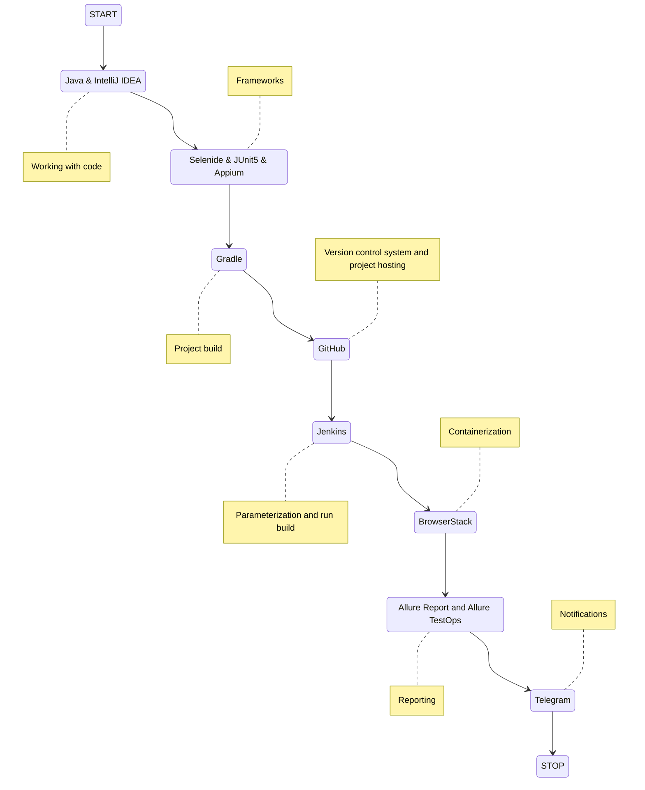
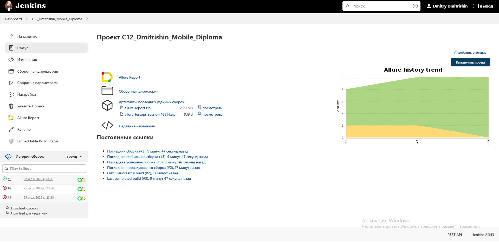
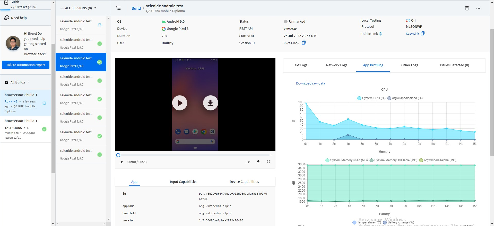
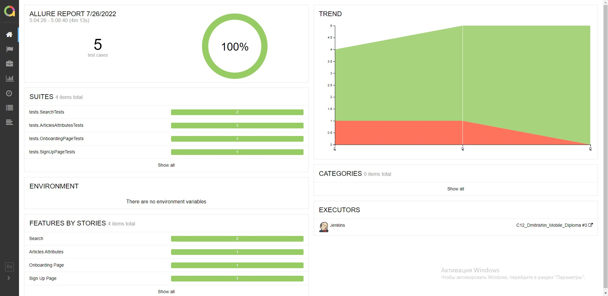
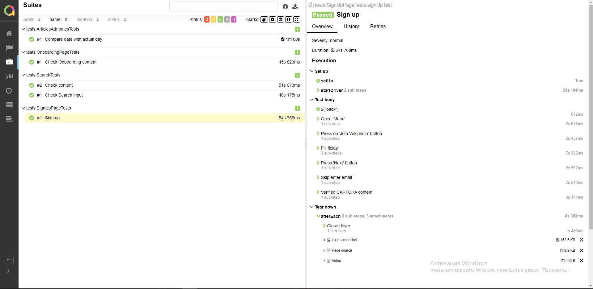
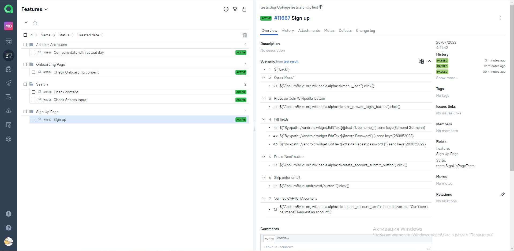
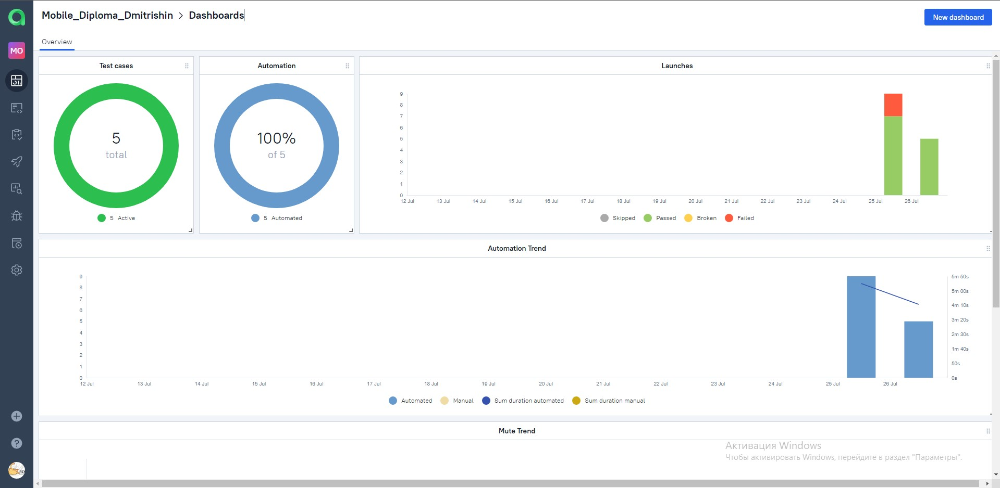
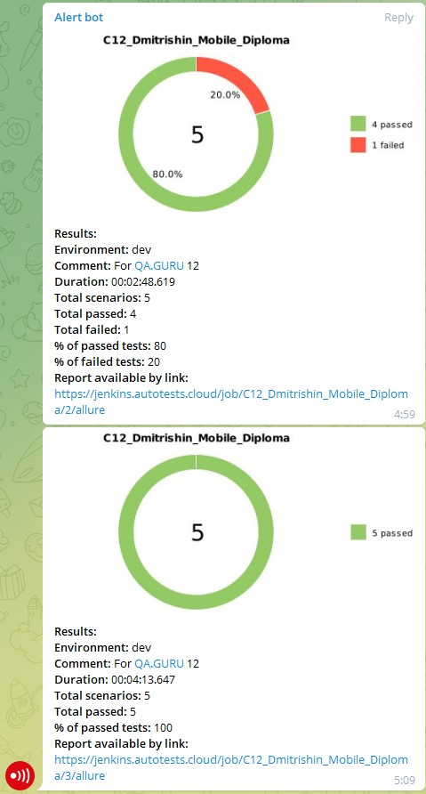

# Test automation project android-application "Wikipedia"

## :page_with_curl:         Content

➠ [Covered functionality](#globe_with_meridians-covered-functionality)

➠ [Technology stack](#computer-technology-stack)

➠ [Running tests from the terminal](#technologist-running-tests-from-the-terminal)

➠ [Build in Jenkins](#-jenkins-build-main-page)

➠ [Test results report in Allure Report](#-test-results-report-in-allure-report)

➠ [Integration with Allure TestOps](#-integration-with-allure-testops)

➠ [Telegram notifications using a bot](#-telegram-notifications-using-a-bot)

➠ [Video example of running a test](#-video-example-of-running-a-test)
## <a name="globe_with_meridians-covered-functionality"></a>:globe_with_meridians: Covered functionality

### UI

- [x] Check Onboarding content
- [x] Compare date with actual day
- [x] Check article content
- [x] Check Search input
- [x] Sign up

## :computer: Technology stack

<p align="center">


</p>



## :technologist: Running tests from the terminal

### Local test run:

```
gradle clean test -DdeviceHost=local
```

### Remote test run:

```
gradle clean test -DdeviceHost=browserstack
```

##  Jenkins Build Main Page

<p align="center">
  
</p>

## 👽 Отчет BrowserStack
We can see the details of passing the tests in your BrowserStack personal account. This often provides useful information about how our application works.
<p align="center">
  
</p>

##  Test results report in Allure Report

### :pushpin: Main page of the Allure report

<p align="center">

</p>

### :pushpin: Page with tests


<p align="center">

</p>


##  Integration with Allure TestOps

### :pushpin: Test cases with launch history

<p align="center">

</p>

### :pushpin: Dashboard


<p align="center">

</p>


##  Telegram notifications using a bot

> After the build is completed, the bot created in <code>Telegram</code> automatically processes and sends a message with a report.
<p align="center">

</p>

## :film_projector: Video example of running a test

> A video is attached to each test in the report. One of these videos is shown below. In this test case we checked sign up
<p align="center">
  
</p>

<a target="_blank" href="https://t.me/YuriyMqa">t.me/dmitrishin13</a>